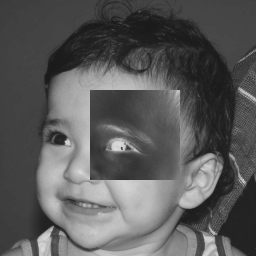

:source-highlighter: rouge
= Processamento Digital de Imagens
Renato Emanuel Medeiros de Lira         renato.lira.016@ufrn.edu.br
:toc: left

== 1 Manipulando pixels em uma imagem

Manipular pixels em uma imagem envolve a capacidade de alterar individualmente os elementos de cor que compõem a imagem. Cada pixel contém informações sobre sua cor específica, como vermelho, verde e azul (RGB), além de valores de transparência em alguns casos. Ao manipular os pixels, é possível realizar uma variedade de transformações na imagem, como ajustar o brilho, a saturação, o contraste, aplicar filtros, redimensionar ou recortar. Essas manipulações permitem corrigir imperfeições, realçar detalhes, criar efeitos especiais, entre outras possibilidades. A manipulação de pixels é uma técnica fundamental em áreas como processamento de imagem, design gráfico, edição de fotos e criação de arte digital. Com a ajuda de bibliotecas de processamento de imagem, é possível acessar e modificar os valores dos pixels em uma imagem, abrindo caminho para inúmeras possibilidades criativas e práticas.

=== 1.1 Exercicio 1.1 - Filtro Negativo (regions.cpp)

O filtro negativo é um mecanismo que busca eliminar conteúdos indesejados, inapropriados ou prejudiciais por meio da aplicação de técnicas de análise e restrição. Ele é amplamente utilizado em diversas áreas, como tecnologia da informação, mídias sociais e segurança, visando proteger os usuários e garantir a qualidade do conteúdo. No entanto, é necessário ter cautela para evitar restrições excessivas e preservar a liberdade de expressão. 

Com isso, crie um programa chamado <<exa_regions>> com base no código de exemplo "pixels.cpp". O programa deve pedir ao usuário as coordenadas de dois pontos, P1 e P2, que estão dentro dos limites do tamanho da imagem. Em seguida, ele deve exibir a imagem fornecida, mas com a região definida pelo retângulo formado pelos pontos P1 e P2 exibindo o negativo da imagem nessa área específica. Esse efeito produzirá uma região destacada com cores invertidas em relação ao restante da imagem.

==== 1.1.1 Código e Resultado.

[[exa_regions, regions]]
[source,cpp]
.regions.cpp
----
include::regions.cpp[]
----

Abaixo temos a imagem original <<fig_biel>> e em seguida a imagem resultante do código <<fig_regions>>. As Coordenadas escolhidas foram P1 (90, 180) e P2 (90, 180).

[[fig_biel, biel]]
.Imagem original
image::biel.png[title="Imagem original"]

[[fig_regions, regions]]
.Saída do programa regions

=== 1.2 Exercicio 1.2 - Troca Regiões (trocaregioes.cpp)

Desenvolva um programa chamado <<trocaregioes.cpp>> com base no código de exemplo "pixels.cpp". O programa deve trocar os quadrantes diagonais na imagem. Para realizar essa troca, utilize a classe "Mat" e seus construtores para criar as regiões que serão intercambiadas. Ao executar o programa, a imagem exibida terá os quadrantes diagonais trocados.

==== 1.1.2 Código e Resultado.

[[exa_trocaregioes, trocaregioes]]
[source,cpp]
.trocaregioes.cpp
----
include::trocaregioes.cpp[]
----

Abaixo temos a imagem original <<fig_biel>> e em seguida a imagem resultante do código <<fig_trocaregioes>>, na qual os quadrantes foram trocados de lugar.

[[fig_trocaregioes, trocaregioes]]
.Saída do programa trocaregioes.cpp
image::trocaregioes.png[title="saída do programa trocaregioes.cpp"]

== 2. Serialização de dados em ponto flutuante via FileStorage

=== 2.1. Exercicio 2 - filestorage.cpp

==== 2.1.1. Código e Resultado.

== 3. Decomposição de imagens em planos de bits

=== 3.1. Exercicio 3 -  esteg-encode.cpp

==== 3.1.1. Código e Resultado.

== 4. Preenchendo regiões

=== 4.1. Exercicio 4 - labeling.cpp

==== 4.1.1. Código e Resultado.

== 5. Manipulação de histogramas

=== 5.1. Exercicio 5 -  histogram.cpp

==== 5.1.1. Código e Resultado.

== 6. Filtragem no domínio espacial I

=== 6.1. Exercicio 6 - filtroespacial.cpp 

==== 6.1.1. Código e Resultado.

== 7. Filtragem no domínio espacial II

=== 7.1. Exercicio 7 -  addweighted.cpp

==== 7.1.1. Código e Resultado.

== 8. A Tranformada Discreta de Fourier

=== 8.1. Exercicio 8 - dftimage.cpp

==== 8.1.1. Código e Resultado.

